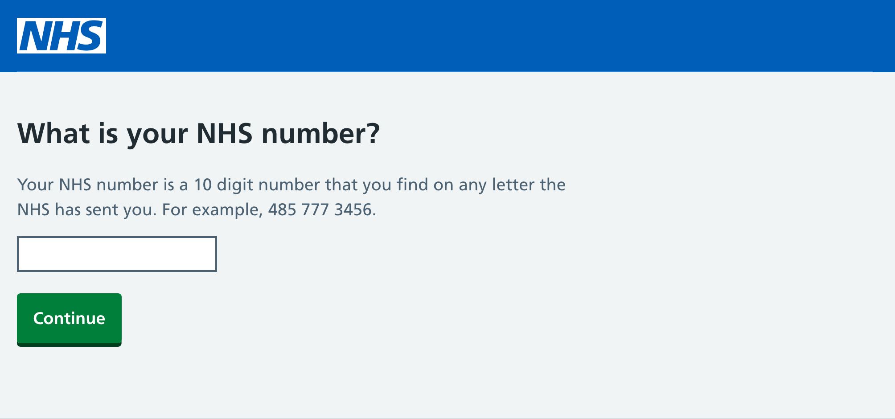

# `nhsuk-frontend-react`


<a href="https://www.npmjs.com/package/nhsuk-frontend-react">

</a>

This is an unofficial React implementation of the [NHS.UK Frontend](https://github.com/nhsuk/nhsuk-frontend) library. It is heavily inspired by [nhsuk-react-components](https://github.com/NHSDigital/nhsuk-react-components), originally written by [Thomas Judd-Cooper](https://github.com/Tomdangov) and [other contributors](https://github.com/NHSDigital/nhsuk-react-components/graphs/contributors).

This implementation supports the latest version of the NHS.UK Frontend library and is written in TypeScript. It is designed to be used with modern React applications and is compatible with Next.js and React Server Components.

## Version compatibility

With the release of v9 of the NHS.UK Frontend library, the version of this library has been bumped to v4. The following table shows the compatibility between the NHS.UK Frontend library and `nhsuk-frontend-react`:

| nhsuk-frontend | nhsuk-frontend-react | branch                                                        |
| -------------- | -------------------- | ------------------------------------------------------------- |
| `8.x.x`        | `3.x.x`              | [v3](https://github.com/rowellx68/nhs-components/tree/v3)     |
| `9.x.x`        | `4.x.x`              | [main](https://github.com/rowellx68/nhs-components/tree/main) |

## Features

- Written in TypeScript
- Polymorphic components for easy customisation
- Compatible with Next.js and React Server Components
- Supports the latest version of the NHS.UK Frontend library
- Supports all components from the NHS.UK Frontend library

## Polymorphic Components

A few components in this library are polymorphic, meaning they can accept a different component as a prop and render as that component. This is particularly useful when you want to use a custom component, say a `Link` component from a routing library, instead of the default `a` tag.

This feature is was taken from [Mantine](https://github.com/mantinedev/mantine), have a look at their [polymorphic components documentation](https://mantine.dev/guides/polymorphic/) for more information.

Here is an example of how you can use a custom `Link` component with the `Header.Logo` component:

```tsx
import { Header, HeaderContainer, HeaderLogo } from 'nhsuk-frontend-react';
import Link from 'next/link';

export const AppHeader = () => (
  <Header>
    <HeaderContainer>
      {/* Now HeaderLogo will have the same prop type as Link. That means that href is now required. */}
      <HeaderLogo
        as={Link}
        href="/"
        variant="logo-only"
        aria-label="NHS homepage"
      />
    </HeaderContainer>
  </Header>
);
```

## Full List of Polymorphic Components

<details>
<summary>Click to expand</summary>

- `ActionLink`
- `AToZ.Item`
- `BackLink`
- `BackToTopLink`
- `Breadcrumb.BackLink`
- `Breadcrumb.ListItem`
- `Button`
- `Card.Image`
- `Card.Link`
- `ContentList.ListItem`
- `DoDontList.Label`
- `ErrorSummary.ListItem`
- `ErrorSummary.Title`
- `Fieldset.Legend`
- `Figure.Image`
- `Footer.ListItem`
- `Header.Logo`
- `Header.NavItem`
- `Header.TransactionLink`
- `Heading`
- `Link`
- `List`
- `Pagination.Item`
- `SummaryList.Row.ActionLink`
- `Tabs.Title`
- `Tabs.ListItem`
- `TaskList.Item.NameAndHint`
- `VisuallyHidden`
- `WarningCallout.Label`
- `VisuallyHidden`

</details>

## Installation

```bash
pnpm add nhsuk-frontend nhsuk-frontend-react
```

## Example

Both usages below will render the following:



### Usage with React

<details>
<summary>Code</summary>

```tsx
import {
  Input,
  Header,
  Container,
  Main,
  Column,
  Row,
  Button,
} from 'nhsuk-frontend-react';

const Component = () => (
  <>
    <Header>
      <Header.Container>
        <Header.Logo href="/" variant="logo-only" aria-label="NHS homepage" />
      </Header.Container>
      <Header.Nav />
    </Header>
    <Container>
      <Main>
        <Row>
          <Column width="two-thirds">
            <form>
              <Input
                label="What is your NHS number?"
                labelProps={{ variant: 'page-heading', size: 'l' }}
                width="10"
                hint={
                  <>
                    Your NHS number is a 10 digit number that you find on any
                    letter the NHS has sent you. For example,{' '}
                    <span className="nhsuk-u-nowrap">485 777 3456</span>.
                  </>
                }
              />
              <Button>Continue</Button>
            </form>
          </Column>
        </Row>
      </Main>
    </Container>
  </>
);
```

</details>

### Usage with Next.js

<details>
<summary>Code</summary>

```tsx
import {
  Input,
  Header,
  HeaderContainer, // notice how we have to import HeaderContainer separately
  HeaderLogo, // Next.js does not work with nested components yet
  Container,
  Main,
  Column,
  Row,
  Button,
} from 'nhsuk-frontend-react';

const Component = () => (
  <>
    <Header>
      <HeaderContainer>
        <HeaderLogo href="/" variant="logo-only" aria-label="NHS homepage" />
      </HeaderContainer>
    </Header>
    <Container>
      <Main>
        <Row>
          <Column width="two-thirds">
            <form>
              <Input
                label="What is your NHS number?"
                labelProps={{ variant: 'page-heading', size: 'l' }}
                width="10"
                hint={
                  <>
                    Your NHS number is a 10 digit number that you find on any
                    letter the NHS has sent you. For example,{' '}
                    <span className="nhsuk-u-nowrap">485 777 3456</span>.
                  </>
                }
              />
              <Button>Continue</Button>
            </form>
          </Column>
        </Row>
      </Main>
    </Container>
  </>
);
```

</details>

## Storybook

All of the components in this library are documented in Storybook.

https://rowellx68.github.io/nhs-components/

## Testing

To run the tests, you can use the following command:

```bash
pnpm test
```

## License

The codebase is released under the MIT Licence, unless stated otherwise.
